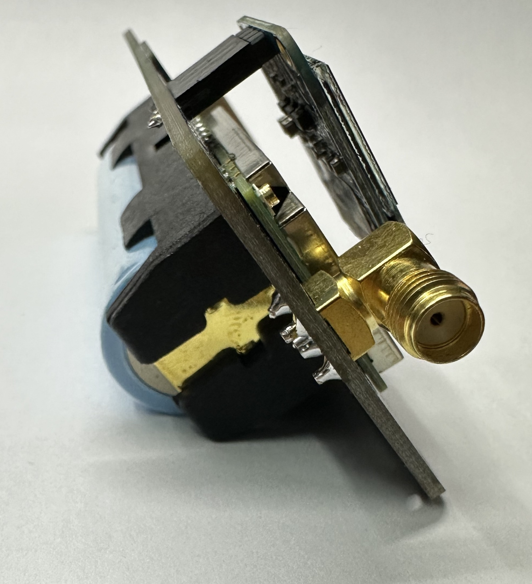

# LightTracker Plus

LightTracker Plus is an ESP32-based development board featuring a 1 Watt SX1268 (433MHz) LoRa module, GPS module, battery holder, and 2 dBi 433 MHz SMA antenna.

LightTracker Plus will be available on https://shop.qrp-labs.com for order soon.

**Important :** LightTracker Plus 1.0 operates on the amateur 70 cm (UHF) radio band with a 30 dBm output power, which typically requires an amateur radio license to operate in many countries. Therefore, if you are not a licensed HAM operator, please ensure to check local regulations and laws before purchasing the module.

## Key Benefits

- Low Power Consumption Capability (Deep Sleep)
- Powerful (1 Watt) LoRa Radio Module
- Compact GPS Module Integrated with Patch Antenna
- GPS Balloon mode, for high altitude up to 80km (Convenient for High Altitude Balloon tracking)
- 18650 Battery Holder with charging capability (Battery not included)
- Suitable for Open Source HAM Radio ESP32 projects like Meshtastic, TinyGS, LoRa APRS Tracker & iGate, etc
- Shipped with preloaded basic [LoRa APRS Software](https://github.com/lightaprs/LightLoRaAPRS/)(Tracking, iGate or Digipeater)
- 0.96 inch OLED Screen (VCC,GND,SCL,SDA) support (OLED screen not included)
- 3D Models (stl files) for printing board case (Case not included)

## Basic Features

- **Software** : Open Source
- **Weight** : 40 grams
- **Dimensions** : 99.9 mm x 40.9 mm x 26 mm
- **IDE** : Arduino & VSCode
- **Platform** : ESP32
- **CPU** : ESP32-S3 MINI
- **Flash** : 8 MB
- **Ram** : 512 kB SRAM
- **Operating Frequency** : 240 Mhz
- **Operating Voltage** : 3.3 Volt
- **Input Voltage** : 2.7 (min) - 5.5 (max) Volt via USB Type C 2.0 or Battery Holder
- **Sensor** : SHTC3 (humidity and temperature)
- **Power Consumption (Deep Sleep)** : ~0.2 mA
- **Power Consumption (Idle)** : ~65 mA
- **LoRa Radio Module** : [EBYTE E22-400M30S](https://www.cdebyte.com/products/E22-400M30S) (SX1268)
- **LoRa Operating Frequency** : 410~493MHz (configurable by code)
- **LoRa Max Power** : 30dBm (configurable by code)
- **LoRa Power Consumption (TX)** : ~650 mA (30dBm)
- **GPS** : Quectel L80RE-M37 (GPS-QZSS)
- **Extended Pins** : I2C, I2S (in gpio pins, you can select random pins to use for I2S ), SPI, UART, 14x GPIO Pin(includes SPI, Analog pins, Touch pins), 4x Analog, 3x TOUCH, 2x CLK_OUT (in uart0 pins)

## Support

If you have any questions or need support, please contact support@lightaprs.com

## Wiki

* **[F.A.Q.](https://github.com/lightaprs/LightTracker-Plus-1.0/wiki/F.A.Q.)**
