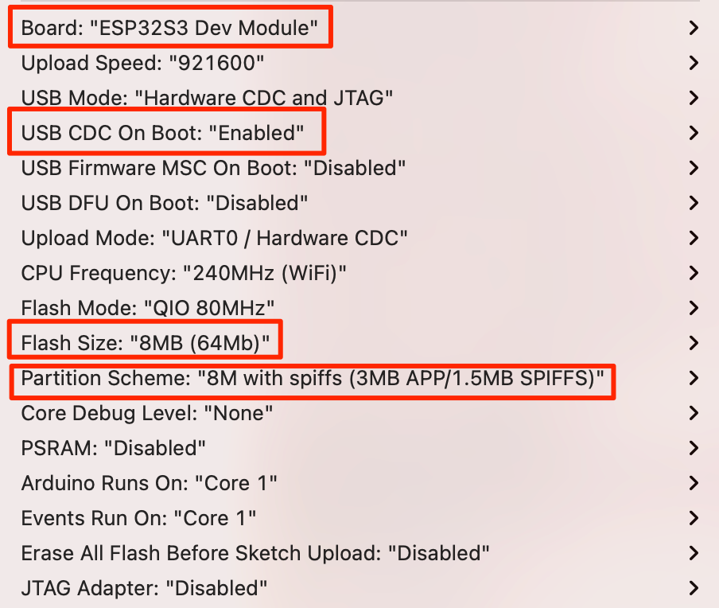

To upload example sketch files to LightTracker Plus, all you need is a Type-C cable, Arduino IDE and configurations as follows:

### 1.Install Arduino IDE

Download and install [Arduino IDE](https://www.arduino.cc/en/Main/Software). If you have already installed Arduino, please check for updates. Its version should be at least v1.8.13 or newer.

### 2.Install ESP32 Arduino

- If you have installed ESP32 Arduino and upload any sketch file to any ESP32 board, skip this step...
- Open the Arduino IDE.
- Open the **File > Preferences** menu item.

- Enter the following URL in Additional Boards Manager URLs:
> https://espressif.github.io/arduino-esp32/package_esp32_index.json
- Separate the URLs using a comma ( , ) if you have more than one URL. Click **OK**.
- Open the **Tools > Board > Boards Manager...** menu item.
- Wait for the platform indexes to finish downloading.
- Type "ESP32" in the search bar until you see the **ESP32** entry and click on it and select latest version.

- Click **Install** .
- After installation is complete, close the **Boards Manager** window.

### 3.Configure ESP32

- Open the **Tools > Board** menu item and select **ESP32S3 Dev Module** from the end of the list.

  
- After selecting **ESP32S3 Dev Module** you will see new options under **Tools** menu. Change these options as follows (keep the rest as is):
- USB CDC ON Boot: "Enabled"
- Flash Size: "8MB (64Mb)"
- Partition Scheme: "8M with spiffs (3MB APP/1.5MB SPIFFS)"

### 4.Copy Libraries & Compile Source Code 

You are almost ready to programme LightTracker Plus 1.0 :)

- First download the repository to your computer using the green "[Code -> Download ZIP](https://github.com/lightaprs/LightTracker-Plus-1.0/archive/refs/heads/main.zip)" button.
- You will notice some folders in the "libraries" folder. You have to copy these folders (libraries) into your Arduino libraries folder on your computer. Path to your Arduino libraries:
- **Windows** : This PC\Documents\Arduino\libraries\
- **Mac** : /Users/\<username\>/Documents/Arduino/libraries/

**IMPORTANT :** LightTracker Plus 1.0 uses more libraries than LightAPRS. So if you purchased LightAPRS and copied libraries before, do it again for LightTracker Plus 1.0. Otherwise you get a compile error.

- Then open the any *.ino file in the examples folder with Arduino IDE.
- Click **Verify** 

### 5.Upload

- First attach an UHF antenna to your module. Radio module may be damaged when not attaching an antenna, since power has nowhere to go. 
- Connect LightTracker Plus 1.0 to your computer with a Type-C cable.
- Holding down the **Boot** button than press the **Reset** button (and release both of them) to enable firmware upload mode.
  
- You should see a COM port under **Tools->Port** menu item. Select that port. 
- Click **Upload**
